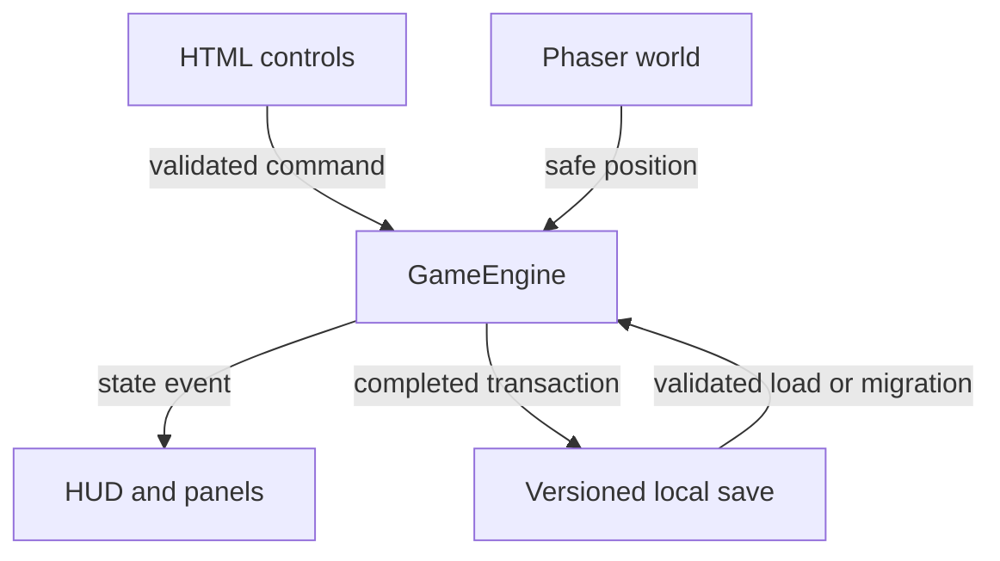

# Architecture

## Layers

| Layer | Responsibility |
|---|---|
| `src/core` | Pure rules, content data, clock, allocation, transactions and save validation. |
| `src/game` | Phaser world drawing, physics, player animation, camera and interaction proximity. |
| `src/ui` | Title, character setup, HUD, touch controls and location/pause panels. |
| `src/main.ts` | Safe application boot and top-level failure message. |

`GameEngine` owns the single authoritative `GameState`. Phaser reads and updates position through that engine; HTML panels issue validated commands to it. Successful commands notify subscribers, update the HUD and save only after the transaction completes.

## State flow

## Important boundaries

- Stable IDs are stored; display names can change without invalidating saves.
- Jobs, items, activities, objectives and locations live in `src/core/content.ts`.
- World building/entrance coordinates live in `src/game/worldData.ts`.
- Money and quantities are checked before mutation.
- A transaction lock blocks repeated clicks from applying the same action concurrently.
- Health and energy are clamped.
- The previous valid save is retained as a backup before replacement.
- Invalid map positions fall back to the last safe position or the fictional home entrance.

## Save schema

Schema 2 stores identity, appearance, needs, attributes, economy, job, inventory, clock, objectives, unlock flags, home level, settings and position. `saveManager.ts` validates schema 2 and migrates a simulated schema 1 for test coverage.

Future cloud saves must be added behind the same storage boundary rather than allowing UI or scenes to write remote state directly.
